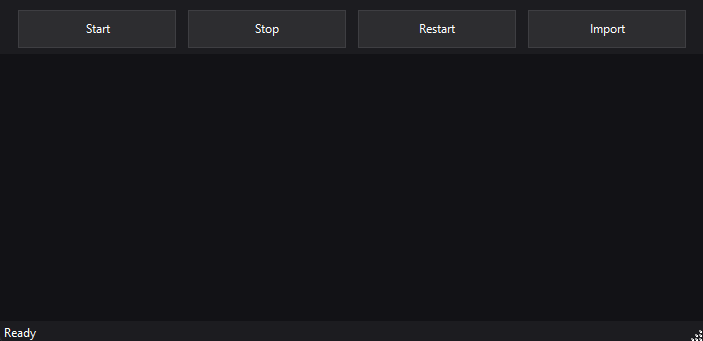

# Steam Lua

A simple tool to manage Steam and import manifest/lua files.

## Features
- Start / Stop / Restart Steam
- Import multiple files at once
  - .manifest → C:\Program Files (x86)\Steam\depotcache
  - .lua → C:\Program Files (x86)\Steam\config\stplug-in
- Dark theme, resizable window

## Download
- Latest release (portable EXE):
  - https://github.com/kozaaaaczx/steam-lua/releases

## Screenshots
Add screenshots (place images in a `assets/` folder and reference here):
```

```

## Requirements
- Windows with PowerShell 5.1+
- Administrator privileges (the EXE requests admin at launch)

## Usage
### Option A: EXE (recommended)
1) Download `Steam lua.exe` from Releases.
2) Run as Administrator (UAC prompt is expected).
3) If SmartScreen appears, click “More info” → “Run anyway”.

### Option B: Run from source (scripts)
```powershell
powershell -NoProfile -ExecutionPolicy Bypass -STA -File ".\steam-lua-gui.ps1"
```
Run PowerShell as Administrator if you plan to import files to Program Files.

## Troubleshooting / AV
- Windows SmartScreen: click “More info” → “Run anyway”.
- Some antivirus tools may flag unsigned PS2EXE binaries as suspicious. This is a false positive for this project. Options:
  - Prefer running the open-source scripts (`steam-lua-gui.ps1`).
  - Build the EXE yourself from source (see below).
  - Submit a false-positive report to your AV vendor with the GitHub link.
- Ensure you run as Administrator to copy into Program Files paths.

## Build EXE (for maintainers)
Requires the `ps2exe` module (one-time install):
```powershell
Install-Module -Name ps2exe -Scope CurrentUser -Force
Import-Module ps2exe
Invoke-PS2EXE -InputFile ".\steam-lua-gui.ps1" -OutputFile ".\Steam lua.exe" -NoConsole -RequireAdmin
```

## License
MIT. See LICENSE for details.
